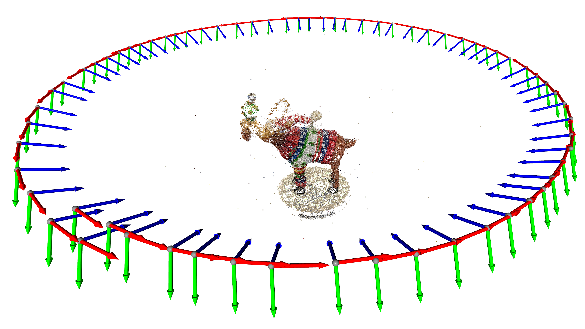

# Structure from Motion

This project was done for Robomath (16811) @ CMU in Fall 2022. All the bookkeeping, initialization, and optimization (including analytical Jacobians!) were done by hand in python. Usage as follows:

- `run.py` runs SfM. Run `python run.py --help` for input/output options.
- `plot.py` shows the 3D point cloud. Run `python plot.py results/point_cloud.npz` to see the resulting moose ornament point cloud.
- `slide_images.py` is full of some helpers to create images for the slides/writeups.
- `point_cloud_to_mesh.py` was a first attempt at some surface reconstruction from the dense point cloud. Requires more tuning.

**More technical info can be found in the [writeup](writeup.pdf) and [slides](slides.pdf).**


## Installation

I recommend installation into a conda environment. A simple command to make and activate a new environment is
```
conda create -n sfm python=3.7
conda activate sfm
```
Then to install all required dependencies, run
```
pip install -r requirements.txt
```